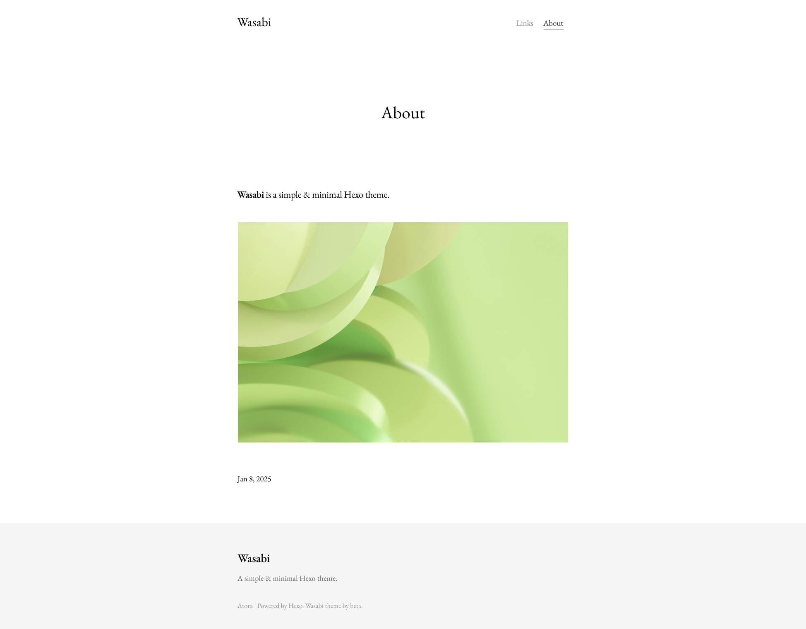

<div align="center">

# Wasabi

 

A simple & minimal Hexo theme.



</div>

[Live demo](https://betakuang.me/) (my blog)

## Prerequisites

Wasabi uses [Pug](https://pugjs.org/). Add `hexo-renderer-pug` to your dependencies:

```bash
npm install hexo-renderer-pug --save
```

## Disqus

To enable Disqus, add the following config to your `_config.yml`:

```yaml
# Disqus
disqus_shortname: YOUR_DISQUS_SHORTNAME # replace with your own Disqus shortname
```

## License

zlib
